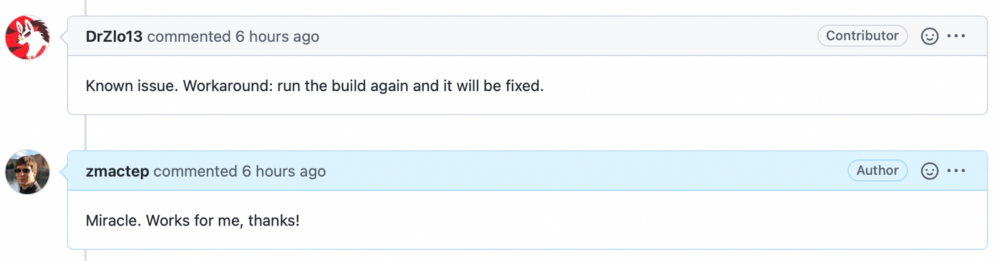
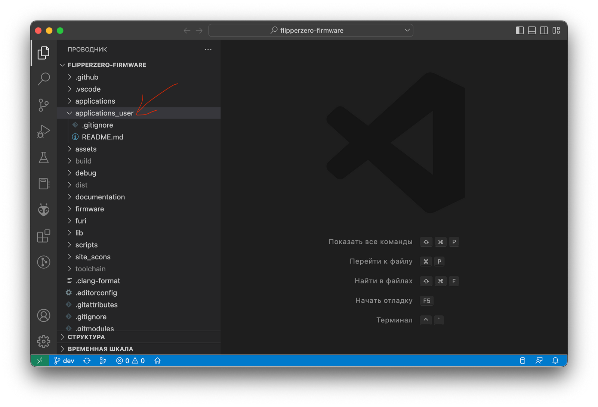
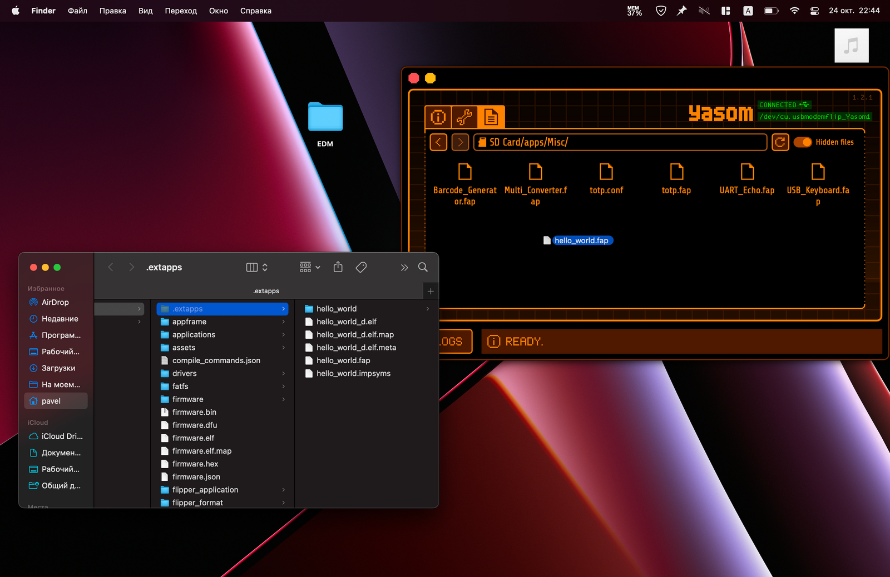
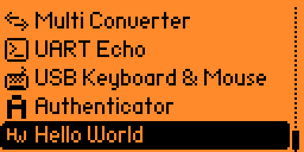

# Написание Hello World для Flipper Zero

Это минимально модифицированная копия [статьи из моего блога](https://yakovlev.me/hello-flipper-zero/).

## Сборка прошивки

Внезапно, но для написания своего приложения в первую очередь потребуется научиться собирать прошивку. Для официальной и модифицированной порядок действий не меняется, потому пока инструкция подходит для любого варианта. 

Изучая репозиторий прошивки я наткнулся на `Brewfile` с зависимостями для macOS. Воспользоваться им не удалось, поскольку, например, указанный `gdb` не поставить из Homebrew на M1. Так что я поставил несколько пакетов вручную:

    $ brew install protobuf protobuf-c dfu-util gcc-arm-embedded

> **UPDATE**. Как выяснилось, и этого можно было не делать. Все, что нужно — это только git. А присутствующий в репозитории Flipper Build Tool (aka `fbt` — читай далее) сам разберется со всеми зависимостями.

Следующим шагом нужно склонировать репозиторий со всеми сабмодулями.

    $ git clone --recursive https://github.com/flipperdevices/flipperzero-firmware.git

> **UPDATE**. Когда я только разбирался с прошивкой и читал пользоватлеьские чаты, то почти на каждый вопрос "почему что-то не работает"  встречал ответ, что пропуск флага `--recursive` — главная ошибка новичка, и надо обязательно его указывать. Но, как оказалось, это не так и `fbt` (вот буквально через один абзац уже!) скачает все сам, как бы вы ни клонировали репозиторий.

При клонировании с сабмодулями будет скачан целый гигабайт всякой всячины. 

    $ du -sh flipperzero-firmware 
    1,0G	flipperzero-firmware

Наш главный друг среди всего этого — утилита `fbt` (Flipper Build Tool) через которую мы будем собирать прошивку и приложения. При её первом запуске без параметров будет скачан toolchain с `gcc-arm`, что намекает, что `gcc-arm-embedded` из Homebrew можно было и не ставить. Неприятно, что даже на мой M1 мак качается версия x86_64, хотя aarm64 сборка тоже существует. Но пока Apple не отключил Rosetta 2 это влияет только на эстетическую составляющую.

    $ ./fbt
    Checking tar..yes
    Checking downloaded toolchain tgz..no
    Checking curl..yes
    Downloading toolchain:
    ######################################################################### 100,0%
    done
    Removing old toolchain..done
    Unpacking toolchain:
    ####################################################### 100.0%
    done
    Clearing..done

Дальше начнется сборка прошивки в debug-режиме — именно это происходит при запуске `fbt` без параметров. У меня она привела к ошибке:

    	APPS	build/f7-firmware-D/applications/applications.c
    	ICONS	build/f7-firmware-D/assets/compiled/assets_icons.c
    	CC	applications/main/archive/scenes/archive_scene.c
    	CC	applications/main/bad_usb/scenes/bad_usb_scene.c
    	PREGEN	build/f7-firmware-D/sdk_origin.i
    	SDKSRC	build/f7-firmware-D/sdk_origin.i
    	CC	applications/main/gpio/scenes/gpio_scene.c
    	CC	applications/main/gpio/gpio_item.c
    	CC	applications/main/gpio/usb_uart_bridge.c
    	CC	applications/main/ibutton/scenes/ibutton_scene.c
    	CC	applications/main/ibutton/ibutton_cli.c
    	CC	applications/main/infrared/scenes/infrared_scene.c
    In file included from applications/services/gui/canvas.h:9,
                     from ./applications/services/dialogs/dialogs.h:3,
                     from build/f7-firmware-D/sdk_origin.i.c:124:
    applications/services/gui/icon_animation.h:10:10: fatal error: assets_icons.h: No such file or directory
       10 | #include <assets_icons.h>
          |          ^~~~~~~~~~~~~~~~
    compilation terminated.
    scons: *** [build/f7-firmware-D/sdk_origin.i] Error 1
    ********** ERRORS **********
    Failed building build/f7-firmware-D/sdk_origin.i: Error 1

Написание [issue](https://github.com/flipperdevices/flipperzero-firmware/issues/1918) на github репозитории официальной прошивки привело к ответу через 12 минут:

Действительно, перезапуск `fbt` решает проблему:

    $ ./fbt
    ... перечисление всех компилируемых файлов ...
    	INFO	
    Loaded 74 app definitions.
    Firmware modules configuration:
    Service:
    	 bt, cli, dialogs, dolphin, desktop, gui, input, loader, notification, power, storage
    System:
    	 updater_app, storage_move_to_sd
    App:
    	 subghz, lfrfid, nfc, infrared, gpio, ibutton, bad_usb, u2f, fap_loader
    Archive:
    	 archive
    Settings:
    	 bt_settings, notification_settings, storage_settings, power_settings, desktop_settings, passport, system_settings, about
    StartupHook:
    	 crypto_start, rpc_start, infrared_start, nfc_start, subghz_start, lfrfid_start, ibutton_start, bt_start, power_start, storage_start, updater_start, storage_move_to_sd_start
    Package:
    	 basic_services, main_apps, settings_apps, system_apps
    Firmware size
    .text         598400 (584.38 K)
    .rodata       157768 (154.07 K)
    .data           1444 (  1.41 K)
    .bss            8432 (  8.23 K)
    .free_flash   290628 (283.82 K)
    	HEX	build/f7-firmware-D/firmware.hex
    	BIN	build/f7-firmware-D/firmware.bin
    Setting build/f7-firmware-D as latest built dir (./build/latest/)
    firmware.bin:  186 flash pages (last page 4.59% full)
    	DFU	build/f7-firmware-D/firmware.dfu
    2022-10-24 18:12:46,569 [INFO] Firmware binaries can be found at:
    	dist/f7-D

Заливать эту прошивку на Flipper мы не будем, вместо этого пойдем дальше к написанию своего приложения.

Последний и весьма опциональный пункт здесь — создать проект для Visual Studio Code. Мне писать в ней удобнее, так чтоя нашел такую возможность весьма приятной. Тем более, что делается это в одну команду все того же `fbt`:

    $ ./fbt vscode_dist    
    	INSTALL	.vscode/c_cpp_properties.json
    	INSTALL	.vscode/launch.json
    	INSTALL	.vscode/settings.json
    	INSTALL	.vscode/tasks.json

## Создание приложения

> **NB** Полный код этого раздела доступен в [1_basic_app](1_basic_app/)

Канонический способ создания новых приложений — это размещение их в директории `applications_user`.

Сначала создадим простейшее приложение, которое будет компилироваться. Делать оно, правда, пока ничего не будет. Но и это мы полечим.

Создадим директорию приложения, конечно же, `hello_world`, а в ней заведем три файла:

- Си-исходник с кодом программы (`hello_world.c`).
- Манифест приложения — Flipper Application Manifest (`application.fam`).
- Иконка приложения — ч/б PNG размером 10x10 px (`hello_world.png`).

Как всегда, самое сложное — это иконка, так что дарю.

Теперь разберемся с кодом. По соглашениям Flipper Zero точкой входа является функция, которая будет называться как наше приложение + суффикс *`app`. Традиционно для C функция будет возвращать код ошибки (0 — все круто), а принимать некоторые данные по указателю. Данные нам не потребуются, так что код с инклудом для *`*int32_*t` будет выглядеть так:

    #include <stdio.h>
    
    int32_t hello_world_app(void *p) {
    	return 0;
    }

Этот гениальный код, к сожалению не скомпирируется, поскольку в проекте по умолчанию включены довольно жесткие правила, а потому любой warning воспринимается как ошибка. Решить эту проблему можно сделав вид, что данные мы все же используем:

    #include <stdio.h>
    
    int32_t hello_world_app(void* p) {
      (void)(p);
      
      return 0;
    }

Отлично, теперь осталось составить только манифест, с помощью которого волшебный `fbt` поймет, что мы делаем новое приложение. О том, как устроен этот файл даже есть [какая-никакая документация](https://github.com/flipperdevices/flipperzero-firmware/blob/dev/documentation/AppManifests.md), из которой мы можем почерпнуть следующее:

- В поле `appid` нужно указать какое-то уникальное имя без пробелов, по которому `fbt` будет собирать наше приложение.
- В поле `name` можно написать что угодно, так приложение будет называться на самом Flipper.
- Поле `apptype` задает тип приложения, для всех наших поделий, пока мы не лезем в систему это будет `FlipperAppType.EXTERNAL`.
- `entry_point` задает точку входа — ту самую функцию, что мы написали выше.
- `fap_icon` указывает на иконку приложения.
- `fap_category` говорит, к какой категории будет относиться приложение (`GPIO`, `Music`, `Misc`, `Tool` и т.д.).

Вооружившись этими знаниями соорудим следующий манифест:

    App(
        appid="hello_world",
        name="Hello World",
        apptype=FlipperAppType.EXTERNAL,
        entry_point="hello_world_app",
        cdefines=["APP_HELLO_WORLD"],
        requires=[
            "gui",
        ],
        stack_size=1 * 1024,
        order=90,
    	fap_icon="hello_world.png",
        fap_category="Misc",
    )

Все, мы можем собирать наше приложение. Делается это командой:

    $ ./fbt fap_{APPID НАШЕГО ПРИЛОЖЕНИЯ}

В нашем случае:

    $ ./fbt fap_hello_world
            CC      applications_user/hello_world/hello_world.c
            SDKCHK  firmware/targets/f7/api_symbols.csv
            LINK    build/f7-firmware-D/.extapps/hello_world_d.elf
    API version 5.0 is up to date
            APPMETA build/f7-firmware-D/.extapps/hello_world.fap
            FAP     build/f7-firmware-D/.extapps/hello_world.fap
            APPCHK  build/f7-firmware-D/.extapps/hello_world.fap

И все! В папке `build/f7-firmware-D/.extapps` теперь лежит наш FAP-файл, который можно любым удобным вам способом закинуть на Flipper. Я пользовался qFlipper:

> **UPDATE**. Продвинутые ребята не дрыгают мышкой, а и такие операции делают через `fbt` из консоли или Visual Studio Code. Ловите команду: `./fbt launch_app APPSRC=hello_world`.

После этого приложение появится в списке в искомой папке:

Запуск приложения не будет приводить ни к каким ошибкам, функция честно исполнится, и приложение тут же завершится. Но это явно не то, ради чего мы тут собрались, так что погрузимся в мелководье организации приложений, которые я уяснил за пару часов ковыряния.

> **NB** Полный код этого раздела доступен в [1_basic_app](1_basic_app/)

## Очередь сообщений

> **NB** Полный код этого раздела доступен в [2_msgqueue](2_msgqueue/)

Как и очень многие графические фреймворки, Flipper организует работу через очередь сообщений. На практике это выглядит примерно так:

    ОЧЕРЕДЬ_СООБЩЕНИЙ = новая_очередь_сообщений()
    
    бесконечный_цикл {
      СООБЩЕНИЕ = возьми_сообщение_из(ОЧЕРЕДЬ_СООБЩЕНИЙ)
    
      если есть СООБЩЕНИЕ {
        хитрая_обработка(СООБЩЕНИЕ)
      }
    }
    
    очисти_очередь(ОЧЕРЕДЬ_СООБЩЕНИЙ)

Для того, чтоб использовать такой функционал нам уже не обойтись одним только `stdio.h`, а потребуется начать использовать заголовки из SDK Flipper. Называется она `FURI`, где-то читал, что расшифровывается это как `FlipperUniversal Registry Implementation`. Кажется, суть уже ушла далеко от названия, но аббревеатура классная, так что её оставили. Помимо нее сразу подключим еще несколько заголовков:

- `gui/gui.h` — отвечает за работу с интерфейсом.
- `input/input.h` — содержит структуры данных и функции для работы с сообщениями от кнопок.
- `notification/notification_messages.h` — содержит структуры данных и функции для работы с уведомлениями, например, светодиодом.

Если что-то из этого вам не нужно, смело удаляйте. Мой же исходник теперь будет выглядеть так:

    #include <stdio.h>
    #include <furi.h>
    #include <gui/gui.h>
    #include <input/input.h>
    #include <notification/notification_messages.h>
    
    int32_t hello_world_app(void* p) {
        UNUSED(p);
    
        return 0;
    }

`UNUSED` — это макрос, определенный в `FURI`, его реализация ровно такая же, как мы использовали раньше, но выглядит в коде симпатичнее.

Очереди сообщений, как я понял (могу жестоко ошибаться), на самом деле глубоко наплевать какие именно сообщения хранить. Это используется для того, чтоб вы могли использовать тот набор событий, который хотите именно вы. При создании вам нужно только указать размер очереди (сколько событий она может хранить до "исчерпания") и размер каждого из них.

Мы начнем с того, что будем поддерживать только один тип событий — `InputEvent`, определенный в `input/input.h`, то есть события от кнопок. Для этого модифицируем нашу функцию следующим образом:

    #include <stdio.h>
    #include <furi.h>
    #include <gui/gui.h>
    #include <input/input.h>
    #include <notification/notification_messages.h>
    
    int32_t hello_world_app(void* p) {
        UNUSED(p);
    
        // Текущее событие типа InputEvent
        InputEvent event;
        // Очередь событий на 8 элементов размера InputEvent
        FuriMessageQueue* event_queue = furi_message_queue_alloc(8, sizeof(InputEvent));
    
        // Бесконечный цикл обработки очереди событий
        while(1) {
            // Выбираем событие из очереди в переменную event (ждем бесконечно долго, если очередь пуста)
            // и проверяем, что у нас получилось это сделать
            furi_check(furi_message_queue_get(event_queue, &event, FuriWaitForever) == FuriStatusOk);
    
            // Если нажата кнопка "назад", то выходим из цикла, а следовательно и из приложения
            if(event.key == InputKeyBack) {
                break;
            }
        }
    
        // Специальная очистка памяти, занимаемой очередью
        furi_message_queue_free(event_queue);
    
        return 0;
    }

Если вы скомпилируете, скопируете на устройство запустите это приложение, то ваш Flipper будет вечно показывать вот такой экран, не реагируя ни на какие нажатия. Единственное, что вас спасет — это перезагрузка (влево + назад).

Почему так происходит? Мы, очевидно, висим в бесконечном цикле, но разве нажатие кнопки "назад" не должно его прерывать?

На самом деле, нет. Потому что в нашей очереди сообщений пока ничего не лежит. Мы из нее читаем, но ничего в неё не пишем. А это в случае с Flipper мы тоже должны делать сами. Разберемся как это воплотить. Но для этого нам придется сначала разобраться с GUI.

> **NB** Полный код этого раздела доступен в [2_msgqueue](2_msgqueue/)

## Графический интерфейс

> **NB** Полный код этого раздела доступен в [3_gui](3_gui/)

Скажу честно, я не особенно сильно тут разбирался, но глобальная идея выглядит очень понятно. Создаем некоторый GUI, который инициирует нашу систему. К этому GUI привязываем view port, который говорит, куда будет рендериться наш интерфейс (очевидно, полноэкранный для нашего простейшего приложения), а дальше привязываем колбэки отрисовки и всяких поддерживаемых событий. В частности, к ним будут относиться те самые нажатия кнопок.

Нового кода будет много, так что сначала кусочки. Создаем новый view port. Тут все просто и без параметров.

    ViewPort* view_port = view_port_alloc();

Создаем коллбэки для отрисовки (`view_port_draw_callback_set`) и отлова нажатий на клавиши (`view_port_input_callback_set`). В обоих случаях помимо указания view port и функции-callback нам также дают возможность передать в callback произвольный контекст. Для отрисовки нам ничего пока не потребуется, а вот в callback нажатий на клавиши удобно передать указатель на нашу очередь сообщений, чтоб пихать в нее нажатые клавиши:

    view_port_draw_callback_set(view_port, draw_callback, NULL);
    view_port_input_callback_set(view_port, input_callback, event_queue);

Теперь создаем общее GUI нашего приложения и подключаем к нему созданный view port в режиме полного экрана:

    Gui* gui = furi_record_open(RECORD_GUI);
    gui_add_view_port(gui, view_port, GuiLayerFullscreen);

После выхода из нашего бесконечного цикла чистить теперь придется не только очередь сообщений, но и созданные объекты:

    gui_remove_view_port(gui, view_port);
    view_port_free(view_port);
    furi_record_close(RECORD_GUI);

Собираем нашу функцию целиком:

    int32_t hello_world_app(void* p) {
        UNUSED(p);
    
        // Текущее событие типа InputEvent
        InputEvent event;
        // Очередь событий на 8 элементов размера InputEvent
        FuriMessageQueue* event_queue = furi_message_queue_alloc(8, sizeof(InputEvent));
    
        // Создаем новый view port
        ViewPort* view_port = view_port_alloc();
        // Создаем callback отрисовки, без контекста
        view_port_draw_callback_set(view_port, draw_callback, NULL);
        // Создаем callback нажатий на клавиши, в качестве контекста передаем
        // нашу очередь сообщений, чтоб запихивать в неё эти события
        view_port_input_callback_set(view_port, input_callback, event_queue);
    
        // Создаем GUI приложения
        Gui* gui = furi_record_open(RECORD_GUI);
        // Подключаем view port к GUI в полноэкранном режиме
        gui_add_view_port(gui, view_port, GuiLayerFullscreen);
    
        // Бесконечный цикл обработки очереди событий
        while(1) {
            // Выбираем событие из очереди в переменную event (ждем бесконечно долго, если очередь пуста)
            // и проверяем, что у нас получилось это сделать
            furi_check(furi_message_queue_get(event_queue, &event, FuriWaitForever) == FuriStatusOk);
    
            // Если нажата кнопка "назад", то выходим из цикла, а следовательно и из приложения
            if(event.key == InputKeyBack) {
                break;
            }
        }
    
        // Специальная очистка памяти, занимаемой очередью
        furi_message_queue_free(event_queue);
    
        // Чистим созданные объекты, связанные с интерфейсом
        gui_remove_view_port(gui, view_port);
        view_port_free(view_port);
        furi_record_close(RECORD_GUI);
    
        return 0;
    }

Теперь нужно написать, собственно, коллбэки. Начнем с `draw_callback`, отвечающего за отрисовку. Он будет принимать на вход два аргумента — canvas, т.е. "холст" на котором мы будем рисовать, и контекст. В нашем случае контекст использоваться не будет, так что воспользуемся уже привычным макросом `UNUSED`. Холст же будем при каждом вызове функции очищать.

    static void draw_callback(Canvas* canvas, void* ctx) {
        UNUSED(ctx);
    
        canvas_clear(canvas);
    }

В этой же функции мы сможем и рисовать-писать на экране. Чтоб приложение не получалось совсем грустным давайте сразу после очистки холста добавим заветные слова "Hello World!". Для этого нужно выбрать шрифт и разместить текст по каким-то координатам. Координаты указывают левый нижний угол объекта, а считаются от левого верхнего угла экрана.

    static void draw_callback(Canvas* canvas, void* ctx) {
        UNUSED(ctx);
    
        canvas_clear(canvas);
        canvas_set_font(canvas, FontPrimary);
        canvas_draw_str(canvas, 0, 10, "Hello World!");
    }

Аналогичным образом разберемся и с callback для клавиш. Он будет получать на вход `InputEvent` — событие нажатия, и наш передаваемый контекст. Функция будет очень простой: возьмем из контекста очередь и положим в нее пришедшее событие.

    static void input_callback(InputEvent* input_event, void* ctx) {
        // Проверяем, что контекст не нулевой
        furi_assert(ctx);
        FuriMessageQueue* event_queue = ctx;
    
        furi_message_queue_put(event_queue, input_event, FuriWaitForever);
    }

Компилируем, заливаем и наслаждаемся!

Мало того, что мы получили "Hello World!" на экране (кажется, стоило сделать отступ слева не нулевым), так еще и кнопка "назад" закрывает приложение!

> **NB** Полный код этого раздела доступен в [3_gui](3_gui/)

## Таймер

> **NB** Полный код этого раздела доступен в [4_time](4_timer/)

На этом можно было бы закончить этот текст, но мне захотелось добавить еще два элемента: таймер и мигание светодиодом. Делаю я это не из-за любви к искусству, а чтоб показать кастомные события в очереди. Это проще всего показать именно на таймере.

Добавляется он так же просто, как и предыдущие события, но при этом не требует инициализации GUI. При создании таймера мы указываем функцию-callback, тип таймера (периодический в нашем случае) и контекст callback`а.

    FuriTimer* timer = furi_timer_alloc(timer_callback, FuriTimerTypePeriodic, event_queue);

Следующим действием мы таймер, который будет срабатывать каждые 500 миллисекунд:

    furi_timer_start(timer, 500);

А в конце, конечно, очистить память:

    furi_timer_free(timer);

Функция-callback тоже выглядит для нас уже похоже:

    static void timer_callback(FuriMessageQueue* event_queue) {
        // Проверяем, что контекст не нулевой
        furi_assert(event_queue);
    
        // А что делать тут?!
    }

И здесь возникает вопрос, а что же нам делать в этом callback? Кажется, было бы здорово так же пихать какие-то события в нашу очередь `event_queue`, чтоб потом вытаскивать их в бесконечном цикле. Но вот незадача, наша очередь умеет хранить события только одного типа — `InputEvent`. Пришла пора это исправить.

> **NB** Полный код этого раздела доступен в [4_time](4_timer/)

## Кастомные события

> **NB** Полный код этого раздела доступен в [5_events](5_events/)

Теперь наша замечательная программа требует сразу два типа событий — нажатие на клавиши и "тикание" таймера. Реализовать это в имеющемся коде довольно просто. Логика будет следующая:

- Перечислим возможные события в виде `enum`.
- Заведем кастомную структуру, которая будет содержать тип события и возможный payload (например, нажатая клавиша для событий нажатия на кнопки).
- Модифицируем нашу очередь под прием таких событий.
- Модифицируем все вызовы `furi_message_queue_put`, чтоб упаковывать события `FURI` в наши кастомные.
- Модифицируем наш цикл обработки событий, чтоб обрабатывать события разного типа.

По этому плану и поедем. Необходимые нам дополнительные структуры будут выглядеть так:

    typedef enum {
        EventTypeTick,
        EventTypeInput,
    } EventType;
    
    typedef struct {
        EventType type;
        InputEvent input;
    } HelloWorldEvent;

В наше событие в качестве payload мы прямо пакуем `InputEvent`. Конечно, можно из него доставать только нужную информацию, но так проще, так что сэкономим думать.

Теперь модифицируем нашу очередь:

    // Текущее событие типа кастомного типа HelloWorldEvent
    HelloWorldEvent event;
    // Очередь событий на 8 элементов размера HelloWorldEvent
    FuriMessageQueue* event_queue = furi_message_queue_alloc(8, sizeof(HelloWorldEvent));
    

Запакуем событие в `input_callback`:

    static void input_callback(InputEvent* input_event, void* ctx) {
        // Проверяем, что контекст не нулевой
        furi_assert(ctx);
        FuriMessageQueue* event_queue = ctx;
    
        HelloWorldEvent event = {.type = EventTypeInput, .input = *input_event};
        furi_message_queue_put(event_queue, &event, FuriWaitForever);
    }

И запакуем событие в нашем таймере (`timer_callback`):

    static void timer_callback(FuriMessageQueue* event_queue) {
        // Проверяем, что контекст не нулевой
        furi_assert(event_queue);
    
        HelloWorldEvent event = {.type = EventTypeTick};
        furi_message_queue_put(event_queue, &event, 0);
    }

Остается теперь только правильно обрабатывать события в цикле:

    // Бесконечный цикл обработки очереди событий
    while(1) {
        // Выбираем событие из очереди в переменную event (ждем бесконечно долго, если очередь пуста)
        // и проверяем, что у нас получилось это сделать
        furi_check(furi_message_queue_get(event_queue, &event, FuriWaitForever) == FuriStatusOk);
    
        // Наше событие — это нажатие кнопки
        if (event.type == EventTypeInput) {
            // Если нажата кнопка "назад", то выходим из цикла, а следовательно и из приложения
            if (event.input.key == InputKeyBack) {
                break;
            }
        // Наше событие — это сработавший таймер
        } else if (event.type == EventTypeTick) {
            // Сделаем что-то по таймеру
        }
    }

Можно проверить, что получившийся код вновь компилируется и работает. Вот только по таймеру пока ничего не происходит. Исправим и это!

> **NB** Полный код этого раздела доступен в [5_events](5_events/)

## Мигание светодиодом

> **NB** Полный код этого раздела доступен в [6_notifications](6_notifications/)

Как я понял, мигание в Flipper — это один из видов нотификации. Подключение использования нотификаций происходит тоже довольно логично:

- Инициализируем нотификатор, в который будем запихивать нотификации.
- Когда нужно шлем нотификации.
- В конце очищаем нотификатор.

Собственно, как здесь описано, так и идем. В блоке инициализации нашей главной функции добавляем:

    NotificationApp* notifications = furi_record_open(RECORD_NOTIFICATION);

В месте, где обрабатываем таймер:

    notification_message(notifications, &sequence_blink_blue_100);

И в конце:

    furi_record_close(RECORD_NOTIFICATION);

У нас возникла магическая константа `sequence_blink_blue_100`, определяющая код нотификации, соответствующей миганию синим светодиодом. На самом деле она определена в подключенном `notification/notification_messages.h`. Там еще много всякого интересного (например, мигание красным светодиодом). Мы же остановимся для примера только на этом. Теперь каждое срабатывание таймером мы будем мигать синим светодиодом!

Ну, и финальная демонстрация!

> **NB** Полный код этого раздела доступен в [6_notifications](6_notifications/)

